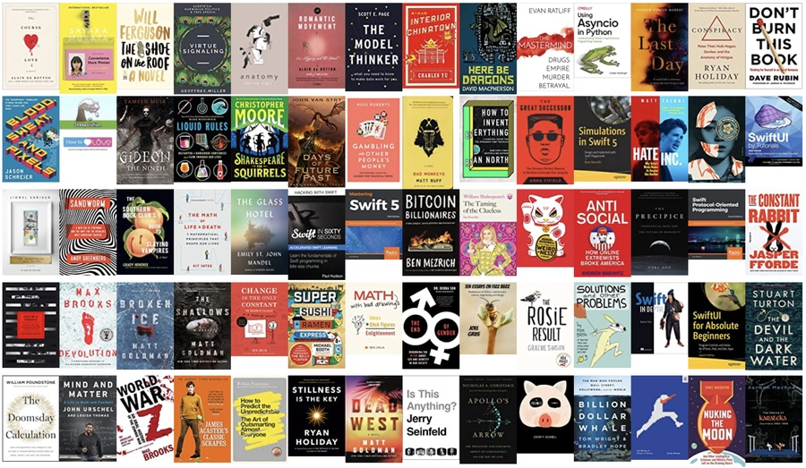

**1 book / week x 6 years**:

> People who don’t read have no advantage over those who cannot read.

— Ryan Holiday, <cite>Stillness is the Key</cite>

**Finish what you start**:

> You dumb shit. You’ve dug your way deep into an active gold mine and are holding off from digging the last two feet because you’re too dumb to appreciate what you’ve got and too lazy to finish what you’ve started.

— Jordan Mechner, <cite>The Making of Prince of Persia</cite>

**Why I like building open source software**:

>When Markov himself looked for applications of his chains, he could have no idea that someday they would be used to model real-life processes such as electron-behavior algorithms and identifying genes. Instead, Markov used his processes to study alliteration in novels.

— John Urschel, <cite>in Mind and Matter</cite>

**Helped me design the algorithms in [GRAPHIITE](https://apps.apple.com/ca/app/graphiite/id1540277552)**:

> Many iPod users complain that the shuffle play feature isn’t random, can’t be random. It just played four Lil Wayne songs in a row! Streaks like that are to be expected. The bug isn’t in the software but in our heads.

— William Poundstone, <cite>Rock Breaks Scissors</cite>

**Changed how I think about teaching**:

> I wish my teachers had been more like my football coaches. I wish they’d shown the same passion about their subjects and had the same impulse to recognize and nurture potential.

— John Urschel, <cite>Mind and Matter</cite>

**Applies to friends and siblings too**:

> But there was Daughter Rule Number Seven to consider: don’t have opinions over boyfriends unless expressly asked, and then – well, play it safe and sit on the fence.

— Jasper Fforde, <cite>The Constant Rabbit</cite>

**Don't let a pandemic get in your way**:

> It’s true. We don’t choose our circumstances. We will have to fall in love when we can.

— Charles Yu, <cite>Interior Chinatown</cite>

**Yep**:

> Plagues are a feature of the human experience. What happened in 2020 was not new to our species. It was just new to us.

— Nicholas Christakis, <cite>Apollo's Arrow</cite>

**The Big Short**:

> If you don’t think you’re going to pay for your mistakes, you’ll make more of them.

— Russ Roberts, <cite>Gambling with Other People's Money</cite>

**Why the days blurred together this year**:

> The greater our acquaintance with the routines of everyday life, the quicker we perceive time to pass, and generally, as we age, this familiarity increases. This theory suggests that, to make our time last longer, we should fill our lives with new and varied experiences, eschewing the time-sapping routine of the everyday.

— Kit Yates, <cite>The Math of Life and Death</cite>

**For the next time you hear someone say "exponential"**:

> Folks toss around “exponential” as a synonym for “very fast,” but its technical meaning is something more wonderful and precise: when a thing’s growth is proportional to its size. In other words: the bigger the object, the faster it grows.

— Ben Orlin, <cite>Change Is the Only Constant</cite>

**Power law distributions are surprisngly everywhere**:

> The preferential attachment model helps explain why the distributions of links on the World Wide Web, city sizes, firm sizes, book sales, and academic citations are power laws.

— Scott Page, <cite>The Model Thinker</cite>

**We need both**:

> Big-coefficient thinking widens roads and builds high-occupancy vehicle lanes to reduce traffic. New-reality thinking builds train and bus systems. Big-coefficient thinking subsidizes computers for low-income students. New-reality thinking gives everyone a computer and reduces mail delivery to three days a week.

— Scott Page, <cite>The Model Thinker</cite>

**How to predict with the Copernican method**:

> Gott’s prediction method does not factor in playwright, stars, casts, or reviews; nor does it consider advance ticket sales, celebrity buzz, advertising campaigns, or what people are willing to pay or do to score a ticket. He nonetheless found that how long a show had already run was a better predictor of its future run than much informed opinion is.

— William Poundstone, <cite>The Doomsday Calculation</cite>

**In /r/wallstreetbets world it's important to remember**:

> A stock is a machine for producing earnings. Were you buying an apartment building as an investment, you’d ask how much rent it was producing. You would want to buy as much rental income as possible for your money. Corporate earnings are the stock market’s rent. Any dividends will be paid out of those earnings. Earnings not paid out may be reinvested in the company, increasing the value of shares.

— William Poundstone, <cite>Rock Breaks Scissors</cite>

**Markets are neat**:

> This planet happens to harbor delicious fruit spheres called “apples.” How should we allocate them? If farmers grow more than consumers want, we’ll find piles of Red Delicious rotting in the streets. If consumers want more than farmers grow, we’ll witness strangers clawing at one another to snag the last McIntosh during a shortage. Yet somehow, against all odds, we manage to grow just about the right number of apples. The trick? Prices.

— Ben Orlin, <cite>Math with Bad Drawings</cite>

**Throwing money at a problem rarely fixes the problem**:

> Any one-time influx of money, regardless of its size, will dissipate in its effect unless it changes transition probabilities.

— Scott Page, <cite>The Model Thinker</cite>

**Money as freedom from money**:

> Because that’s what money gives you: the freedom to stop thinking about money.

— Emily St. John Mandel, <cite>The Glass Hotel</cite>

**Sometimes your money can do more good than you can**:

> When you donate money to a cause, you effectively transform your own labor into additional work for that cause. If you are more suited to your existing job and the cause is constrained by lack of funding, then donating could even help more than direct work.

— Toby Ord, <cite>The Precipice</cite>

**Exerpt from a speculative fiction novel about the USD going to zero**:

> Plots set in the future are about what people fear in the present.

— Lionel Shriver, <cite>The Mandibles</cite>

**Don't rush to settle *all* your debts**:

> What is good fiscal policy may be bad amorous policy —  for part of love is to fall into debt and yet tolerate the uncertainty arising from owing someone something, trusting them with the ensuing power, the choice it gives them of how and when to claim their dues.

— Alain de Botton, <cite>The Romantic Movement</cite>

**Don't get too comfortable**:

> Doing well is the trap. A different kind, but still a trap.

— Charles Yu, <cite>Interior Chinatown</cite>

**Don't take it personally**:

> People tune out nothing faster, these days, than an artist asking for attention.

— Jeremy Bushnell, <cite>The Weirdness</cite>

**Take a beat**:

> Anger is not a graceful emotion. I’ve never gotten mad and been like, I’m glad I behaved like that!

— Allie Brosh, <cite>Solutions and Other Problems</cite>

**Stop complaining**:

> Things work out in the end, and if they don’t, you won’t be in much of a position to complain anyways.

— David Macpherson, <cite>Here Be Dragons</cite>

**Moderation**:

> Tis one thing to partake of doobies at A party, where one sparketh up with friends; Yet ’tis another quite to be fried always, Thy brain e’er poison’d.

— Ian Doescher, <cite>William Shakespeare's the Taming of the Clueless</cite>

**Yes you should turn off the lights but**:

> The entire transport sector, including trains, planes, ships, trucks, and cars, accounts for 25 percent of the country’s energy use, while the heating and cooling of buildings through air conditioning accounts for nearly 40 percent.

— Mark Miodownik, <cite>Liquid Rules</cite>

**Anthropomorphized Rabbit POV**:

> Driving cars and talking and having TV was kind of fun, and clothes and eating out totally rock. But the hate, the fear, the greed. It just doesn’t make any sense. You’re trying to run a twenty-first-century world on Palaeolithic thoughts and sentiments.

— Jasper Fforde, <cite>The Constant Rabbit</cite>

**Why we hate each other**:

> There’s utility in keeping us divided. As people, the more separate we are, the more politically impotent we become.

— Matt Taibbi, <cite>Hate Inc.</cite>

**Steelman > Strawman**:

> It’s not possible to know whether you’re right without understanding the other side.

— Debra Soh, <cite>The End of Gender</cite>

**How to spot a liar**:

> She remembered reading somewhere that the liar supplied too many details, and tried instead to allow silence to fill the room.

— Andrew Hunter Murray, <cite>The Last Day</cite>

**I like creativity, truth, and progress**:

> Censorship kills creativity, truth, and progress in obvious ways. Without the free exchange of ideas, people can’t share risky new ideas (creativity), test them against other people’s logic and facts (truth), or compile them into civilizational advances (progress).  

— Geoffrey Miller, <cite>Virtue Signaling</cite>

**It might just be good because *n* is small**:

> The formula for the standard deviation of the mean implies that large populations have much lower standard deviations than small ones. From this, we can infer that we should see more good things and more bad things in small populations.

— Scott Page, <cite>The Model Thinker</cite>

**Just because critics like it doesn't mean that you have to like it**:

> Rather a lot of wines win awards, by the way; in many competitions, the vast majority of wines entered by the producers win a commendation.

— Mark Miodownik, <cite>Liquid Rules</cite>

**Not all masculinity is toxic**:

> Men’s behavior is, to some extent, the result of female sexual preferences. If women didn’t want to mate with masculine men, these traits would have been removed from the gene pool long ago.

— Debra Soh, <cite>The End of Gender</cite>

**Remember when you were little, and your sister was playing with that thing, and then suddenly, you really, really, wanted to play with that thing**:

> Girard’s theory of mimetic desire holds that people have no idea what they want, or what they value, so they are drawn to what other people want. They want what other people have.

— Ryan Holiday, <cite>Conspiracy</cite>

**Exerpt from a journal written in the late '80s**:

> There’s no guarantee the new game will be as successful. Or that there will even be a computer games market a couple of years from now.

— Jordan Mechner, <cite>The Making of Prince of Persia</cite>

**Simplification is hard, vital work**:

> That was one of the most challenging parts of making any game—narrowing the possibilities down from infinity to one.

— Jason Schreier, <cite>Blood, Sweat, and Pixels</cite>

**lol**:

> Quotation is a serviceable substitute for wit.

— Ryan North, <cite>How to Invent Everything</cite>
