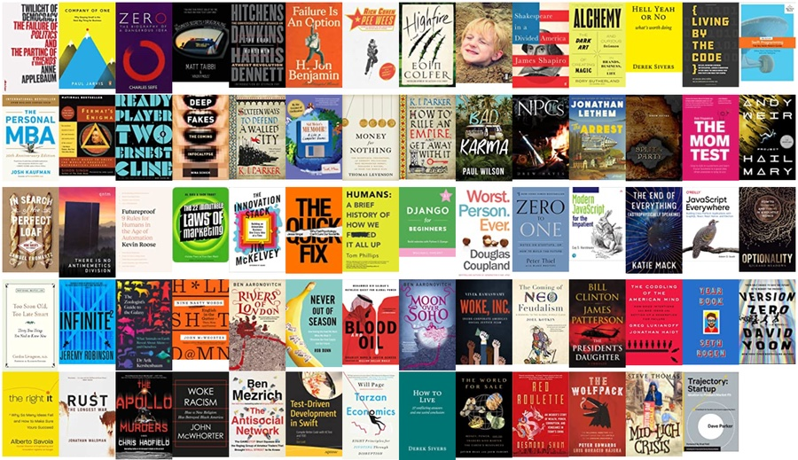

My favourite pearls of 2021, curated from the 69 books that I read and 1736 highlights that I clipped. Click to expand for the original quote and source:

You can do anything, not everything.

"You can have anything you want, but you can’t have everything you want."

— Richard Meadows (Optionality)

Master something!

"Mastery is the best goal because the rich can’t buy it, the impatient can’t rush it, the privileged can’t inherit it, and nobody can steal it."

— Derek Sivers (How to Live)

A task will take up any amount of time you give it.

"The funny thing, though, is that any task will take up the time we give it."

— Paul Jarvis (Company of One)

Make sure you’re building the right it before you attempt to build it right.

"A small percentage of products fail in the market because they are poorly launched or built; the majority fail because they are the wrong product idea to start with."

— Alberto Savoia (The Right It)

Work on big problems that generate interesting results along the way.

"It’s fine to work on any problem, so long as it generates interesting mathematics along the way—even if you don’t solve it at the end of the day."

— Simon Singh (Fermat's Enigma)

Some problems just can’t be solved with logic.

"If you expose every one of the world’s problems to ostensibly logical solutions, those that can easily be solved by logic will rapidly disappear, and all that will be left are the ones that are logic-proof – those where, for whatever reason, the logical answer does not work. Most political, business, foreign policy and, I strongly suspect, marital problems seem to be of this type."

— Rory Sutherland (Alchemy)

While the world pushes us to add, the secret is to subtract.

"Life can be improved by adding, or by subtracting. The world pushes us to add, because that benefits them. But the secret is to focus on subtracting."

— Derek Sivers (Hell Yeah or No)

You can choose to be harmed, or not.

"Choose not to be harmed—and you won’t feel harmed. Don’t feel harmed—and you haven’t been."

— Jonathan Haidt (The Coddling of the American Mind)

Never get offended by, or defensive over, feedback.

"Steady yourself and keep calm. Asking for genuine Feedback (the only useful kind) requires thick skin—no one likes hearing their baby is ugly. Try not to get offended or defensive if someone doesn’t like what you’ve created; they’re doing you a great service by telling you so."

— Josh Kaufman (The Personal MBA)

A compliment isn’t worth anything.

"A compliment costs them nothing, so it’s worth nothing and carries no data."

— Rob Fitzpatrick (The Mom Test)

Don’t let doubt will weigh you down.

"Age and experience may bring wisdom, but sometimes it’s useful to be a young person who hasn’t learned how to doubt himself yet."

— Sid Meier (Sid Meier's Memoir!)

Failure is inevitable. Might as well learn how to get back up.

"Life is mostly failure. It’s falling short, getting cut, not making teams. It will happen again. It happens to everyone. All you can control is how you react. Everyone gets knocked down. Some people stay down. Others get up. Which will you be?"

— Derek Sivers (Pee Wees)

Failure is the best fertilizer.

"Most of what you make will be fertilizer for the few that turn out great."

— Derek Sivers (How to Live)

Hype is distracting.

"When things are going well, a company doesn’t need the hype. When you need the hype, it usually means you’re in trouble."

— Al Ries (The 22 Immutable Laws of Marketing)

Time is the best filter.

"Ignore all news. If it’s important, there will eventually be a good book about it."

— Derek Sivers (How to Live)

Luck isn't a wheelbarrow.

"I have strong views about not tempting providence and, as a wise man once said, the difference between luck and a wheelbarrow is, luck doesn’t work if you push it."

— KJ Parker (Sixteen Ways to Defend a Walled City)

Learning "when" is often more important than learning “how".

"Schools teach how. We learn to copy what works with the emphasis always on the how and not the when. I learned how to construct complicated mathematical models, but never learned when presenting such a model was inappropriate. I learned to reason logically, but never learned when logic might offend someone. I learned contract law, but never learned when to just shake hands. Learning when to do something is far more difficult than learning how to do that same thing, if only because we must always learn how first."

— Jim McKelvey (The Innovation Stack)

Better to avoid "the worst" than aim for “the best”.

"Most darts players aim for the treble 20, because that’s what the professionals do. However, for all but the best darts players this is a mistake: if you are not very good, your best approach is not to aim at treble 20 at all, but instead to aim at the south-west quadrant of the board, towards treble 19 and 16. You won’t get 180 that way, but nor will you score 3. It is a common mistake in darts to assume that you should simply aim for the highest possible score – you should also consider the consequences if you miss. Many real-life decisions have a scoring rubric that is more like darts than archery."

— Rory Sutherland (Alchemy)

Don’t handcuff yourself to luxury.

"Never accept luxury, or you’ll find it hard to do without because it will feel like loss."

— Derek Sivers (How to Live)

Just because you have money doesn't mean you have to spend it.

"When you have the money, one of the things that media tells you is to spend it: They show you in ad after ad: this is the way you’re supposed to treat the money. Buy shit, show out."

— Matt Taibbi (The Business Secrets of Drug Dealing)

Increase your net worth. Decrease your expense ratio.

"When in doubt, net worth and expense ratios are the best financial metrics to focus on. They build optionality in a complementary way: a higher net worth positions you to take advantage of opportunities, while a lower expense ratio keeps you streamlined and resilient to unexpected events."

— Richard Meadows (Optionality)

You can’t buy your way to heaven.

"Corporations used to try to convince you that buying their stuff would make you cool; now they tell you buying it will make you good."

— Vivek Ramaswamy (Woke, Inc.)

Success is something you have to keep earning.

"Someone who played football in high school can’t call himself an athlete forever. Someone who did something successful long ago can’t keep calling himself a success. You have to keep earning it."

— Derek Sivers (Hell Yeah or No)

The things that matter most are rarely measured.

"We’re in a world where what matters most is often what is measured least, yet what matters least will be measured most."

— Will Page (Tarzan Economics)

Happiness is something to do, someone to love, and something to look forward to.

"The three components of happiness are something to do, someone to love, and something to look forward to. Think about it. If we have useful work, sustaining relationships, and the promise of pleasure, it is hard to be unhappy."

— Gordon Livingston (Too Soon Old, Too Late Smart)

People often rise to, or are constrained by, the expectations we set for them.

"Choosing a player for a top team can become a self-fulfilling prophecy: Did he make it because he was better, or did he get better because he made it?"

— Rich Cohen (Pee Wees)

Choose your own constraints before someone else chooses them for you.

"The meaning of life is something like: To trade the constraints imposed upon you by others, for constraints you impose upon yourself."

— Richard Meadows (Optionality)

These days nothing is ordinary, everything is sacred, and that’s the problem.

"How did we come to this farcical point where your politics chooses your sandwiches and your sandwich makers must choose their politics? I’m tempted to say that nothing is sacred anymore, but America’s problem is actually the opposite: nothing is allowed to be ordinary anymore."

— Vivek Ramaswamy (Woke, Inc.)

Never get in the way of a good story.

"Never interfere in potential source material."

— Steve Thomas (Mid-Lich Crisis)

While this list is mostly to help set the tone for who I want to be and what I want do in 2022, I hope you find it valuable.

