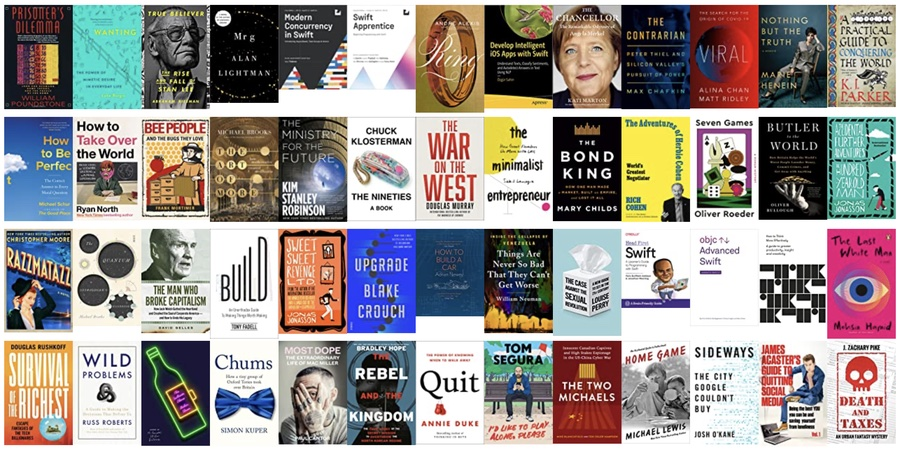

I read a bunch of books in 2022... here's what I learned from them:

You can either control the algorithm or be controlled by it.

"You either tell robots what to do, or are told by robots what to do; you live either above the algorithm, or below it."

— Louise Perry (The Case Against the Sexual Revolution)

Sure, a forklift can lift more weight but that's not the point.

"'Oh my God, AIs can beat humans, what do we do about this?' I really think, 'It doesn't fucking matter.' I'm a rock climber, and AI being able to beat me at Go matters as much as a helicopter being able to beat me at a rock climb."

— Oliver Roeder (Seven Games)

There's a lot of unpublished research out there...

"The public sees only the research that scientists decide to publish, not the projects that fail, that remain unfinished, or that they choose to keep secret."

— Alina Chan (Viral)

The best art persuades us of something.

"Many works of art are trying to persuade us of something rather than just pleasing us."

— Alain de Botton (How to Think More Effectively)

Don't let what you don't have get in the way of what you do.

"The more important task of life is to recognize what you do not have while being grateful for what you do."

— Douglas Murray (The War on the West)

A choice isn't (necessarily) a mistake.

"Life choices that turn out differently from what we hoped aren't mistakes. They're just choices that turned out differently than we hoped."

— Russ Roberts (Wild Problems)

There's no luck in the long run.

"In the long run, there is no luck. In the short run, there is nothing but."

— Oliver Roeder (Seven Games)

Be careful "Plan B" doesn't turn into "Plan A".

"People who have something to fall back on usually end up falling back on it."

— Rich Cohen (The Adventures of Herbie Cohen)

Pay more attention to your thoughts.

"The genius doesn't have different kinds of thoughts from the rest of us, they simply take them more seriously."

— Alain de Botton (How to Think More Effectively)

You can change what you want, to become what you want.

"We are in the process of becoming. So give some thought as to what you desire to desire."

— Russ Roberts (Wild Problems)

Virtue is just the cumulative sum of virtuous actions.

"Virtue comes about, not by a process of nature, but by habituation... We become just by doing just actions, temperate by doing temperate actions, brave by doing brave actions."

— Michael Schur (How to be Perfect)

Independence isn't permanent.

"Modern contraception has allowed us to stretch out that young adult stage artificially, giving the illusion that independence is our permanent state. But it isn't—it's nothing more than a blip, which some of us will never experience at all."

—Louise Perry (The Case Against the Sexual Revolution)

Take more pictures of friends and less pictures of things.

"Once, when I returned from a vacation with pictures of beautiful landscapes, he scolded me, saying, 'Where are the people? The faces? In ten years, it's not that geyser you'll want to see. It's the faces of your friends.'"

— Rich Cohen (The Adventures of Herbie Cohen)

Let them prove you wrong.

"I implied that the skills needed for advanced bowyery were beyond them. They resolved to show me how wrong I was. Perfect."

— KJ Parker (A Practical Guide to Conquering the World)

Look inwards when trying to figure out what others want.

"When trying to work out what others want to eat, or what they might like to hear, or why they may be upset, the best move is to put our own ego into the picture, to imagine that our experience is relevant and that, despite the beard or different skin colour or gender or degree of wealth or geographical origins, what we're faced with is someone who is, first and foremost, a human like us."

— Alain de Botton (How to Think More Effectively)

People just want what other people want.

"We don't want the things we want because we judge them to be good, we want them because other people want them."

— Max Chafkin (The Contrarian)

Sameness—not difference—is the cause of conflict.

"Remember that conflict is caused by sameness, not by difference. If everything is equally good or important, the propensity for conflict is higher."

— Luke Burgis (Wanting)

Siblings really are naturally rivalrous...

"'Do you know the data on siblings across species?'" he asked, before I was even half done. I didn't. 'Oh, yeah,' he said. 'Half the time they kill each other.'"

—Michael Lewis (Home Game)

All she needs is a runway.

"Women do not need to be changed, adjusted, domesticated, moulded, formed, or coddled. We need space and a runway."

— Marie Henein (Nothing But the Truth)

If you don't know, the answer is "No".

"If you feel like you've got a close call between quitting and persevering, it's likely that quitting is the better choice."

— Annie Duke (Quit)

Good interrupting is often good listening.

""The good listener (paradoxically) is a skilled interrupter. But they don't interrupt to intrude their own ideas; they interrupt to help the other get back to their original, more sincere, yet elusive concerns."

— Alain de Botton (How to Think More Effectively)

Who, not what, you know.

"[Things you'll] need to make it in the modern world: guile, greed, charm, and a deep appreciation that what you know is less important than who you know."

— Michael Lewis (Home Game)

Community. Problem. Product. Business. In that order.

"It's the community that leads you to the problem, which leads you to the product, which leads you to your business."

— Sahil Lavingia (The Minimalist Entrepreneur)

Start. And don't stop.

"Most people don't start. Most people who start don't continue. Most people who continue give up. Many winners are just the last ones standing. Don't give up."

— Sahil Lavingia (The Minimalist Entrepreneur)

The story is the product.

"Your messaging is your product. The story you're telling shapes the thing you're making."

— Tony Fadell (Build)

In negotiations "dumb" is often better than "smart".

"What are the most powerful words in a negotiation? Are they 'I'm an expert. I know better?' No. They're 'Who?', 'Huh?' and 'Wha?' When it comes to negotiating, you'd be better off acting like you know less, not more. In some cases, dumb is smarter than smart, and inarticulate is better than articulate. You want to train yourself to say, 'I don't know' … 'You lost me' … 'Could you repeat that?' The most powerful words in business are 'I don't understand. Help me.'"

— Rich Cohen (The Adventures of Herbie Cohen)

Cutting costs ≠ prosperity

"You can't cost-cut your way to prosperity."

— David Gelles (The Man Who Broke Capitalism)

Prevention just isn't good for "The Economy".

"A toxic spill is good for the GDP because we spend a lot to clean it up. Fixing a bridge doesn't increase the GDP as much as tearing it down and building a new one."

— Douglas Rushkoff (Survival of the Richest)

Hope negates stagnation.

"Our society is decadent and stagnant because it lacks hope. Hope is the desire for something that is 1) in the future, (2) good, (3) difficult to achieve, and (4) possible."

— Luke Burgis (Wanting)

You should go long civilization (because the short bet won't ever pay out).

"You can short civilization if you want. Not a bad bet really. But no one to pay you if you win. Whereas if you go long on civilization, and civilization (therefore) survives, you win big. So the smart move is to go long."

— Kim Stanley Robertson (The Ministry for the Future)

Don't get stuck in the pool next to the ocean.

"Meanwhile, everyone is more or less imitating everyone else. Our culture is stuck because we're fighting over space in a pool, next to the ocean."

— Luke Burgis (Wanting)

Every social movement is a power grab.

"Every great social movement, every war, every revolution, every political programme, however edifying and Utopian, really has behind it the ambitions of some sectional group which is out to grab power for itself."

— Simon Kuper (Chums)

Be wary of those who reduce others to groups by their accident of birth.

"Treat people as individuals, and reject those who would try to reduce them to membership of a group they belonged to solely by accident of birth."

— Douglas Murray (The War on the West)

Good writing is good editing.

"When science fiction author Orson Scott Card teaches creative writing, he has the students give one another feedback on their drafts. But instead of grading the students based on their final essays, he grades them on the quality of the feedback they gave their classmates. His insight was that becoming a great writer requires becoming a great editor—learning to revise is essential to writing well."

— Russ Roberts (Wild Problems)

While I make these compilations for myself, I hope you find them useful!

