I started going to the [Stratford Festival](https://www.stratfordfestival.ca/) with my grandparents when I turned seven. Honestly, I hated that first time. Shakespeare and seven-years-old go together about as well as peanut butter and snot. But, it meant a lot to my grandparents. So, I did the Festival again when I was eight.

I hated that second time, too. But the third time we did the Festival I hated it a little bit less. And the fourth time I actually kind of enjoyed it.

By the eighth grade Shakespeare had become a significant enough part of my life that I decided to write my speech on *The Bard*. I can't remeber it all exactly but it was something like, "Why you should give Shakespeare a chance in High School" (I was really popular...)

Now, Shakespeare at the Stratford Festival has become an incredibly rich tradition for me and my grandparents. We've done the festival for 16 years in a row! And we're just now starting to plan our seventeenth adventure. The only problem: We're running out of plays to see! And it's getting harder and harder to remember what we've actually seen.

This year, Stratford is running *Twelfth Night*, *Romeo and Juliet* and *Timon of Athens*. I was sure we had seen *Twelfth Night* and *Romeo and Juliet* so our decision was pretty easy. But still, I was kind of curious about what was still left...

Data Investigation
------------------

Simply pulling and graphing the runs for every play for single season didn't really get me anywhere...

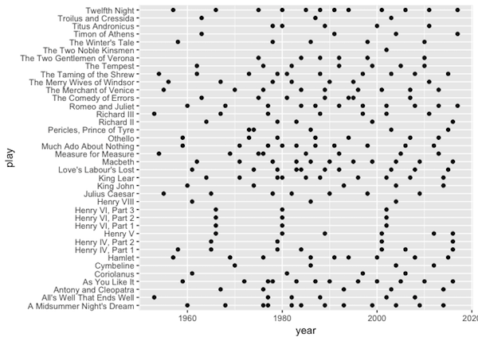

Trying to get fancy with lines instead of points didn't help either...

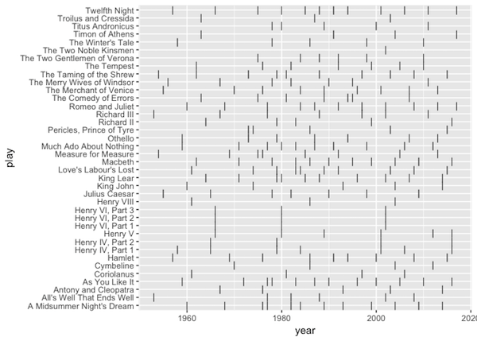

Zooming in the *Histories* was interesting and telling. Notice how the *Henry* plays are bunched up and played at the same time during the same season...

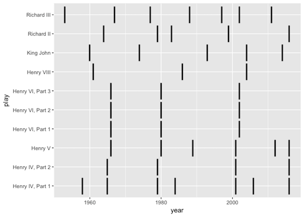

But zooming back out and colouring all the genres on the same vertical line plot really didn't work...

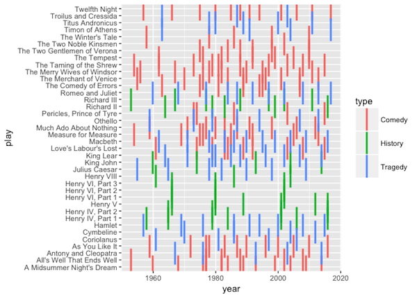

Faceting the genres with three columns was a disaster...

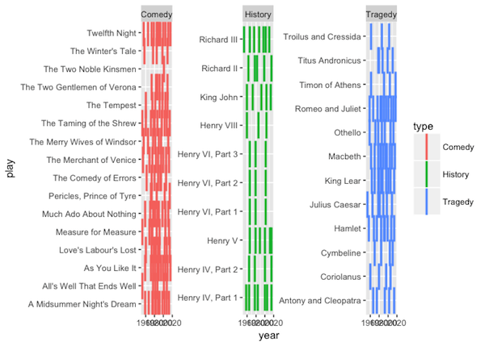

And a one column facet wasn't much better...

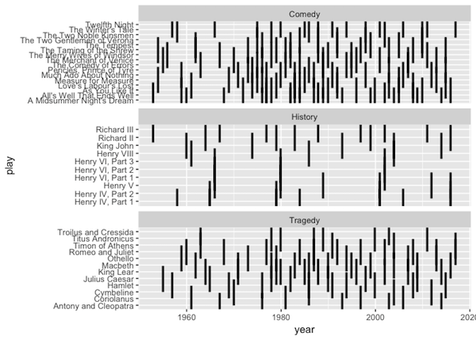

I was starting to get somewhere when I reverted back to points (instead of lines) and when I reordered the data accoring to the most recent runs of each play...

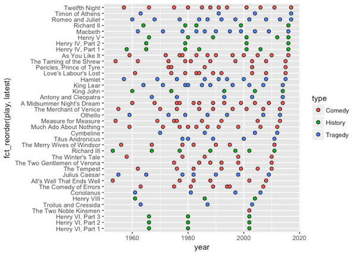

Moving the y-axis text over...

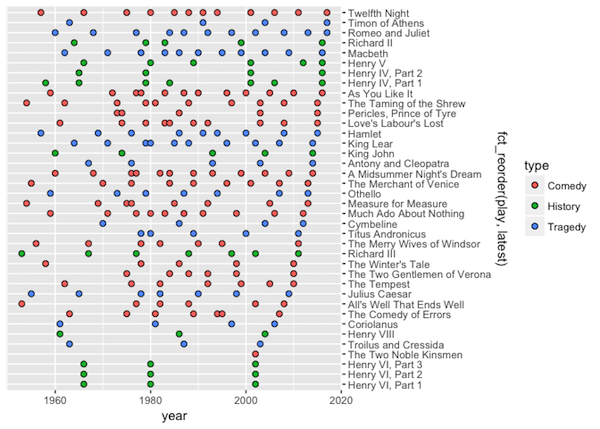

And trimming the data to 2000 helped immensely...

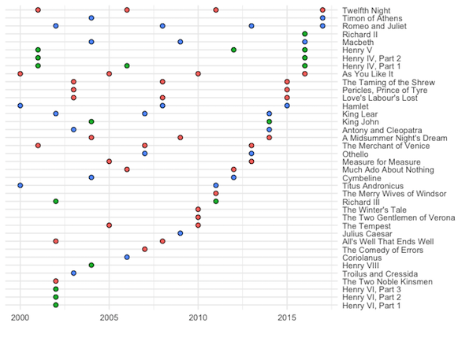

At this point, I was able to reverse out exactly the play that me and my grandparents had seen and when.

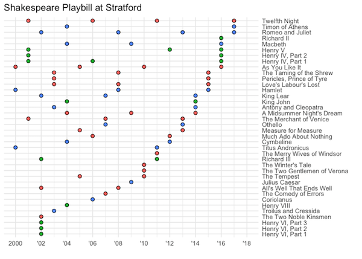

After trying to clean up the styling...

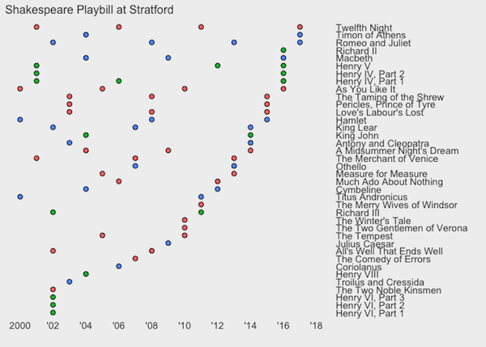

And trying to mess with the colors (gross)...

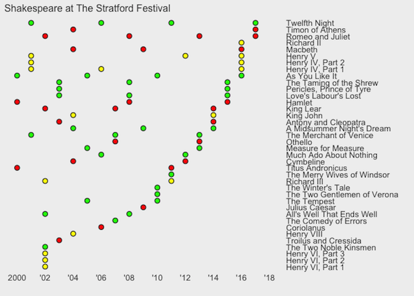

I finally...

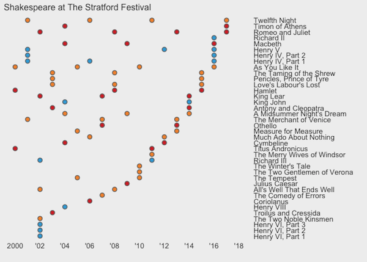

...arrived at this polished and finished version.

Here, I present every play that me and my grandparents have seen so far (the Xs)...

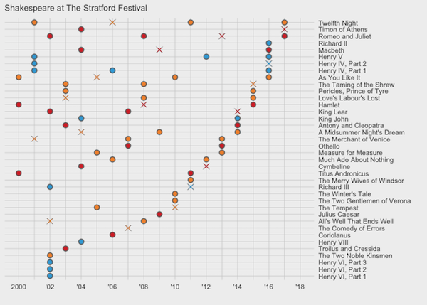

The cool thing about this graphic is that you can infer what Stratford might play in the seasons to come (seems *Coriolanus* and *The Two Noble Kinsmen* are due for a run)...

If you're interested in the code for each graph and the process I used to pull the data from Wikipedia it's available on [GitHub](https://github.com/maxhumber/maxhumber.com/tree/master/_R)
