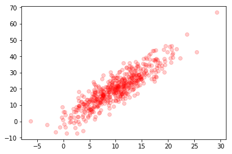

I just finished\* writing the static site generator for this blog. And I'm actually kind of excited about it! Though creating [yet](http://docs.getpelican.com/en/stable/) [another](https://getnikola.com/) [static](https://hyde.github.io/) [site](https://grow.io/) engine is probably—no definitely—overkill, none of generators I looked at and played with met my exact needs...

I knew that I wanted something super lightweight. Something that could seamlessly handle markdown files and Jupyter notebooks. And something that was built in Python. So I built my own thing.

Right now, the [main chunk of code](https://github.com/maxhumber/maxhumber.com/blob/master/build.py) that powers this website is sitting at about 100 lines. Where, importantly, most of the heavy lifting within that file is delegated to [jinja2](https://palletsprojects.com/p/jinja/), [markdown2](https://github.com/trentm/python-markdown2), and [nbconvert](https://nbconvert.readthedocs.io/en/latest/). Beyond these wonderful packages, I'm using [Bootstrap](https://getbootstrap.com/), [Pygments](http://pygments.org/) and [GitHub Pages](https://pages.github.com/) to pull everything together.

And it really does all pull together. For example, this page is generated by [this](https://github.com/maxhumber/maxhumber.com/blob/master/blog/2019-09-19_yass.ipynb) notebook. All I had to do to publish was type `make publish` into a terminal.

With my new bespoke static site generator (which, I guess I should just call *yass* at this point?) I can handle DataFrames:

```python
import pandas as pd

df = pd.DataFrame({
    'artist': ['Tame Impala', 'Childish Gambino', 'The Knocks'],
    'listens': [8_456_831, 18_185_245, 2_556_448]
})

df
```

```
artist   listens
0       Tame Impala   8456831
1  Childish Gambino  18185245
2        The Knocks   2556448
```

Print statements and flashy outputs (shameless [chart](https://github.com/maxhumber/chart) plug):

```python
from chart import bar

print('\nGood shit...\n')
bar(df.listens, df.artist, width=20, mark='🔊')
```

```
Good shit...

     Tame Impala: 🔊🔊🔊🔊🔊🔊🔊🔊🔊           
Childish Gambino: 🔊🔊🔊🔊🔊🔊🔊🔊🔊🔊🔊🔊🔊🔊🔊🔊🔊🔊🔊🔊
      The Knocks: 🔊🔊🔊
```

Matplotlib graphs (harder than it looks, but that's the point):

```python
import numpy as np
from matplotlib import pyplot as plt
%matplotlib inline

np.random.seed(42)
N = 500
x = np.random.normal(10, 5, size=N)
y = 2 * x + np.random.normal(0, 5, size=N)

plt.figure(figsize=(6, 4))
plt.scatter(x, y, c='r', alpha=1/5);
```



And embedded images:


I've ostensibly removed all of the barriers that historically prevented me from updating my blog regularly over the past couple of years. So expect me to write more? Hopefully? We'll see...
<sup>*nothing is ever finished</sup>
